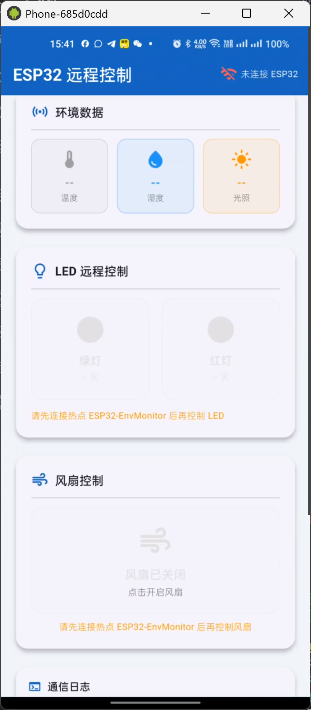
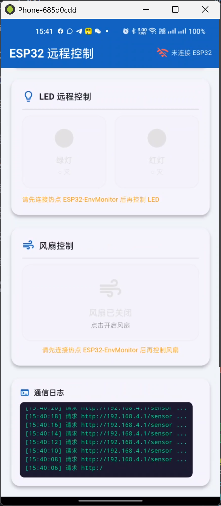

# ESP32 远程控制 APP

一个基于 Flutter 的 ESP32 环境监测与远程控制应用。手机连接 ESP32 热点后，应用会通过 HTTP 访问 `http://192.168.4.1`，轮询环境传感器数据，并提供 LED 与风扇继电器控制能力。

## 功能特性

- 环境数据展示：温度、湿度、光照强度实时显示。
- 连接状态提示：展示 ESP32 热点连接状态与请求日志。
- LED 控制：支持绿灯、红灯远程开关控制。
- 风扇控制：支持风扇继电器远程开关控制。
- 通信日志：记录传感器请求、连接状态和控制指令结果。
- 明文局域网 HTTP：Android 端已允许 `192.168.4.1` HTTP 访问。

## 应用截图

| 环境数据与控制入口 | 通信日志 |
| --- | --- |
|  |  |

## 技术栈

- Flutter 3.41.6
- Dart 3.11.4
- Provider 6.x 状态管理
- http 1.2.x HTTP 客户端
- Android Gradle Plugin 8.11.1
- Kotlin 2.2.20

## 项目结构

```text
lib/
  main.dart                 # 应用入口与 Provider 注入
  models/app_state.dart     # 传感器数据模型和全局状态
  screens/home_screen.dart  # 主界面、传感器卡片、LED/风扇控制和日志
  services/http_service.dart # ESP32 HTTP 轮询与控制请求
android/
  app/src/main/AndroidManifest.xml # Android 权限和明文 HTTP 配置
```

## 运行环境

- Flutter SDK：建议使用 `3.41.6` 或更高兼容版本。
- Android SDK：需要可用的 Android 构建工具和已连接的真机/模拟器。
- ESP32：手机需要连接到 `ESP32-EnvMonitor` 热点，设备默认地址为 `192.168.4.1`。

## 运行方式

```powershell
flutter pub get
flutter devices
flutter run -d <device-id>
```

如果使用本项目验证过的 SDK 路径：

```powershell
C:\development\flutter\bin\flutter.bat pub get
C:\development\flutter\bin\flutter.bat run -d <device-id>
```

## ESP32 HTTP 接口

- `GET /sensor`：返回传感器数据，示例字段包含 `temp`、`humi`、`lux`、`alarm`、`fan`。
- `POST /led`：发送 LED 控制状态，Body 示例：`{"state": true}`。
- `POST /fan`：发送风扇控制状态，Body 示例：`{"state": false}`。

## 注意事项

- 应用访问的是 ESP32 AP 热点内网地址，未连接热点时会显示未连接并禁用控制按钮。
- Android 清单文件已开启 `android:usesCleartextTraffic="true"`，用于访问局域网 HTTP 服务。
- 当前项目用于课程设计、嵌入式实验或物联网远程控制演示。
